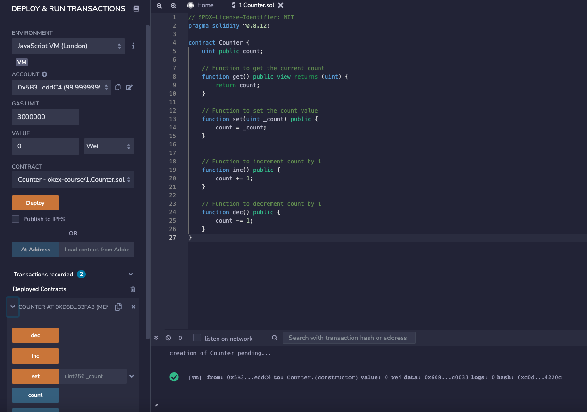
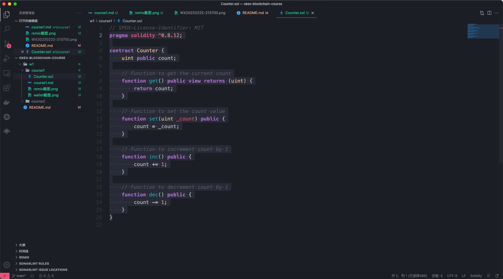

# Week1 - Course1

## 1.创建Metamask钱包
Address: 0x71498272759319b26245Bc221cB618b679C043C8


## 2.转账
https://goerli.etherscan.io/tx/0xec11792b1877fe389d342f96db29f5965ed73531c060ede7b80f1abf8cea05ec

## 3.Remix创建合约


## 4.VSCode


## 5.1.Hardhat部署合约
https://goerli.etherscan.io/address/0x6ffc54c3c3736da7517b6b347e807a5aa692e067

## 5.2.Hardhat编写Test case
```sh
cd counter-project-hardhat
npx hardhat test
```

## 6.1.Truffle部署合约
https://goerli.etherscan.io/address/0x6ffc54c3c3736da7517b6b347e807a5aa692e067

## 6.2.Truffle编写Test case
```sh
cd counter-project-hardhat
npx hardhat test
```
