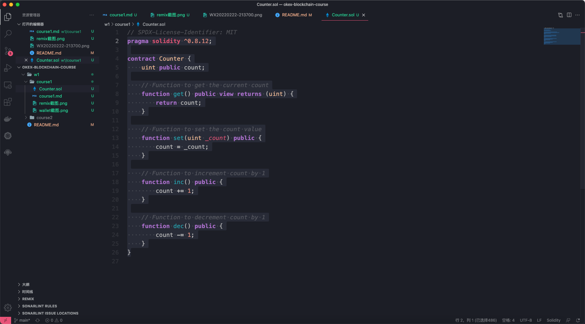

# Week1 - Course1

## 1.创建Metamask钱包

## 2.转账
https://goerli.etherscan.io/tx/0xec11792b1877fe389d342f96db29f5965ed73531c060ede7b80f1abf8cea05ec

## 3.Remix创建合约

## 4.VSCode

## 5.Truffle部署合约

## 6.编写Test case
