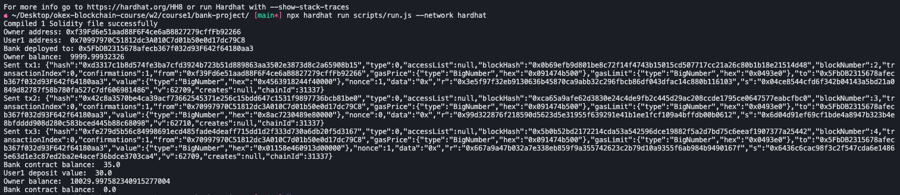
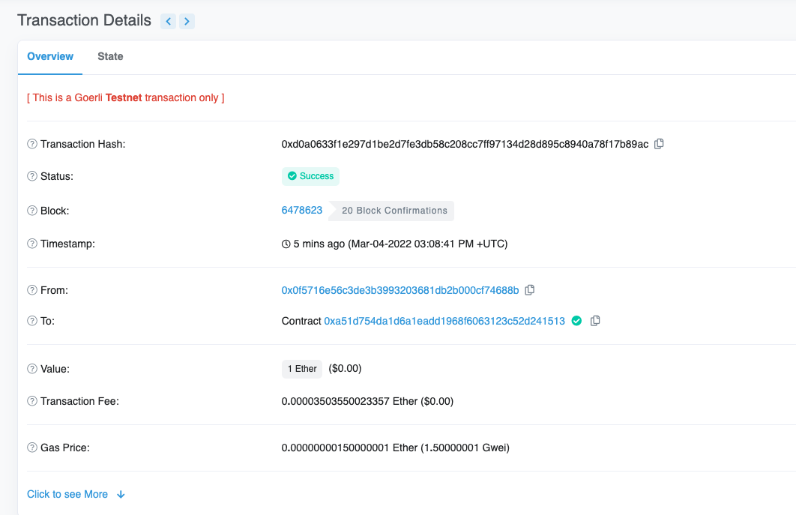
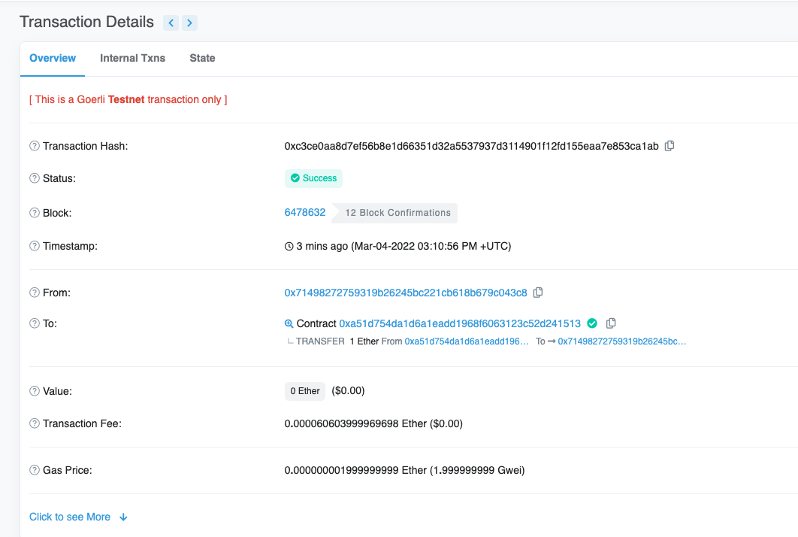

# Week2 - Course1

## 1.本地运行截图
```sh
cd bank-project
npx hardhat run script/run.js
```



## 2.部署到goerli
```sh
npx hardhat run scripts/deploy.js --network goerli
```
Owner: 0x71498272759319b26245Bc221cB618b679C043C8

https://goerli.etherscan.io/address/0xa51D754da1d6a1EADD1968f6063123C52d241513


## 3.另一账户发送ether给Bank

https://goerli.etherscan.io/tx/0xd0a0633f1e297d1be2d7fe3db58c208cc7ff97134d28d895c8940a78f17b89ac

 
## 4.启用脚本调用合约Rug
```sh
cd bank-project
npx hardhat run scripts/rug.js --network goerli
```
https://goerli.etherscan.io/tx/0xc3ce0aa8d7ef56b8e1d66351d32a5537937d3114901f12fd155eaa7e853ca1ab
