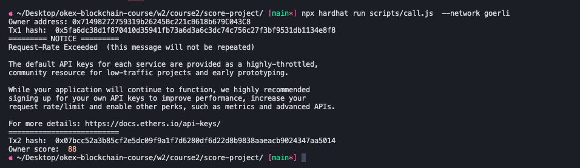

# Week2 - Course2

## 1.Remix调试截图


## 2.本地运行截图
```sh
cd score-project
npx hardhat run script/run.js
```


## 3.部署到goerli
```sh
npx hardhat run scripts/deploy.js --network goerli
```
Owner: 0x71498272759319b26245Bc221cB618b679C043C8

https://goerli.etherscan.io/address/0xB5690568a40B2EfF33Ede02210e27C13E365de12


## 4.创建Score合约并填入学生分数

```sh
cd bank-project
npx hardhat run scripts/call.js --network goerli
```
