# Week3 - Course1

## 1.Remix调试截图
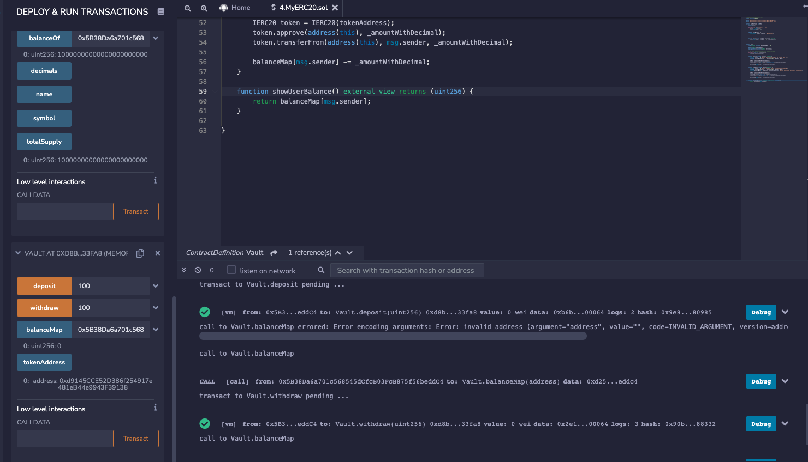

## 2.本地运行截图
```sh
cd erc20-project
npx hardhat run script/run.js
```
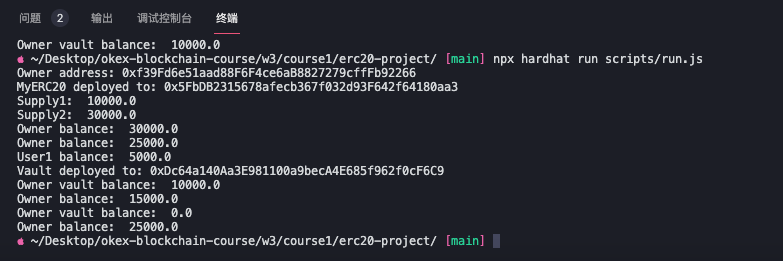


## 3.部署到goerli
```sh
npx hardhat run scripts/deploy.js --network goerli
```
Owner: 0x71498272759319b26245Bc221cB618b679C043C8
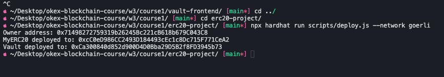
MyERC20: https://goerli.etherscan.io/address/0xcC0eD986CC2493D184493cEc1c8Dc715F771CeA2

Vault: https://goerli.etherscan.io/address/0xCa300840d852d900D4D0Bba29D5B2f8FD3945b73

### 3.1 脚本调用合约转账
```sh
npx hardhat run scripts/call.js --network goerli
```
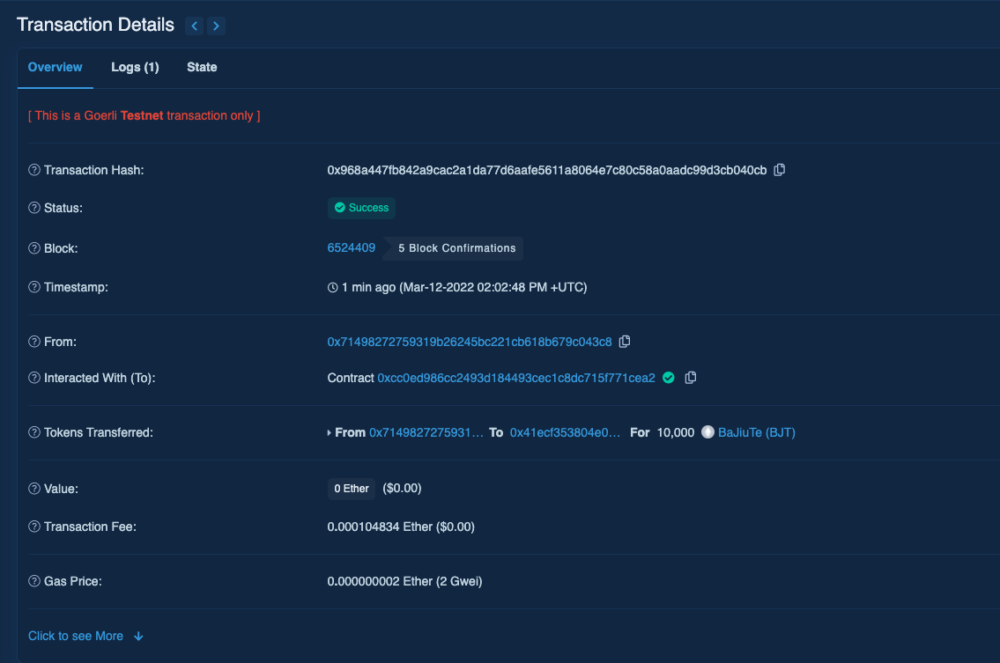
Tx: https://goerli.etherscan.io/tx/0x968a447fb842a9cac2a1da77d6aafe5611a8064e7c80c58a0aadc99d3cb040cb

## 4.前端运行
```sh
cd vault-frontend
yarn
yarn start
```

### 4.1 初始界面
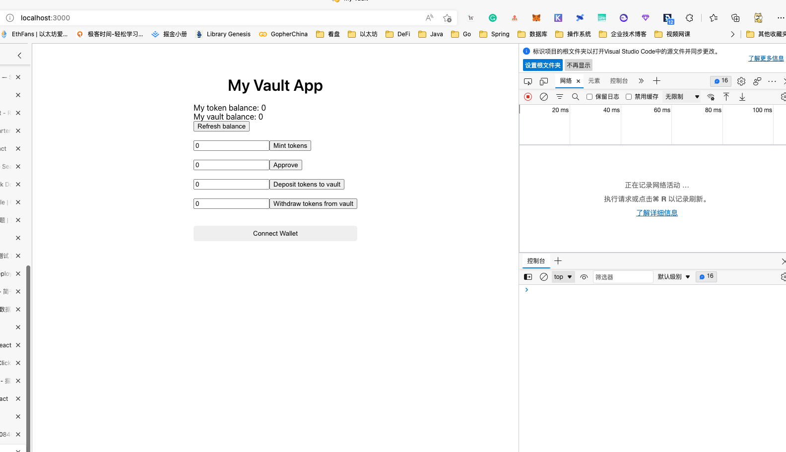

### 4.2 连接钱包
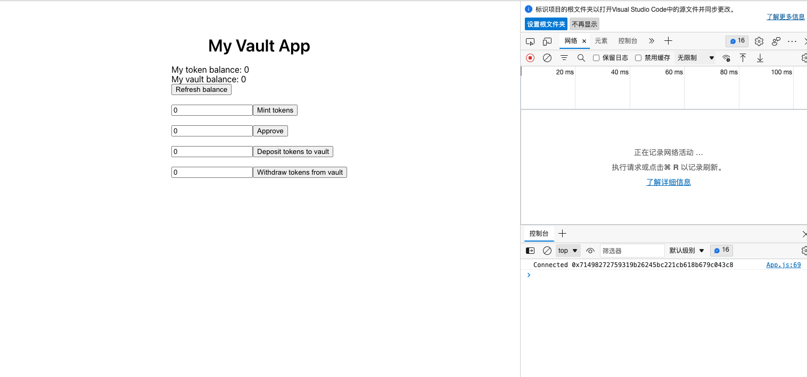

### 4.3 Mint 50000个Token
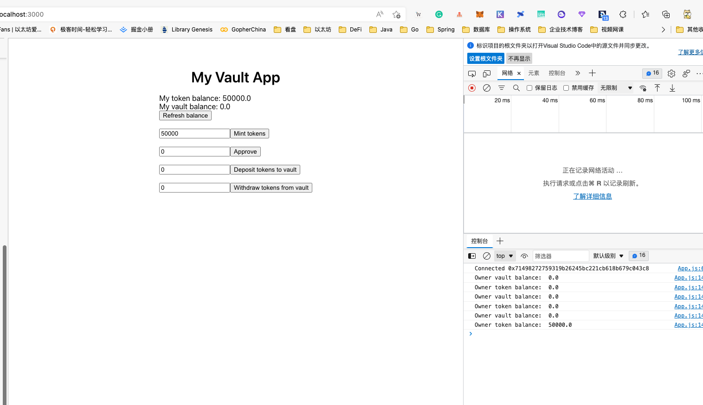

### 4.4 Approve 50000个额度
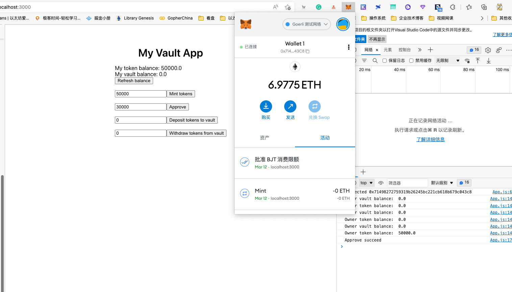

### 4.5 存入30000个
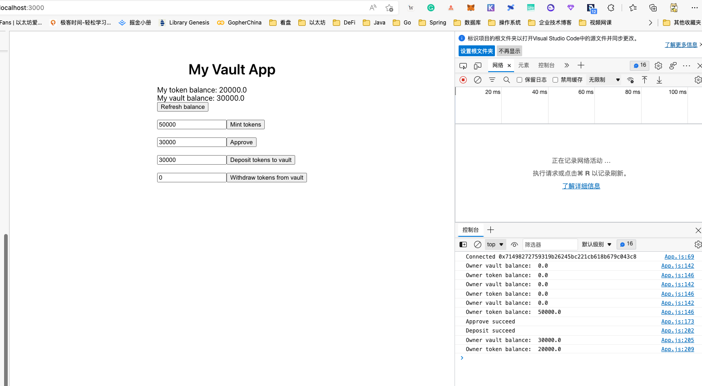

### 4.6 提取20000个
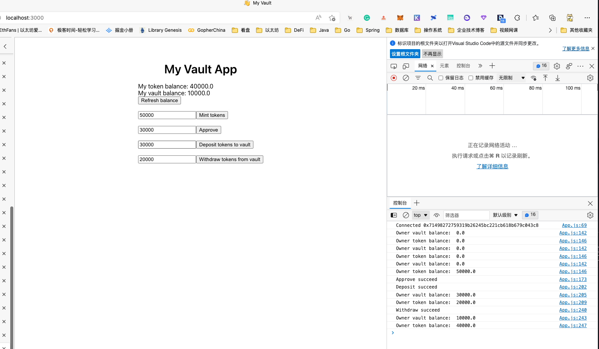

### 4.7 流水截图
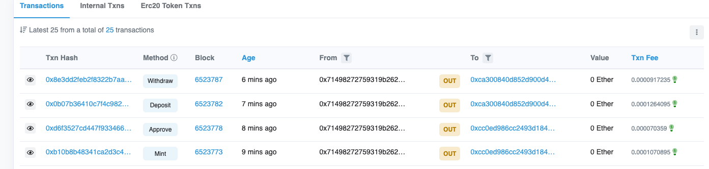