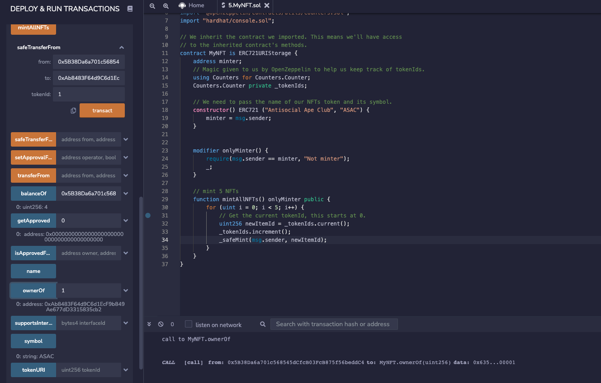
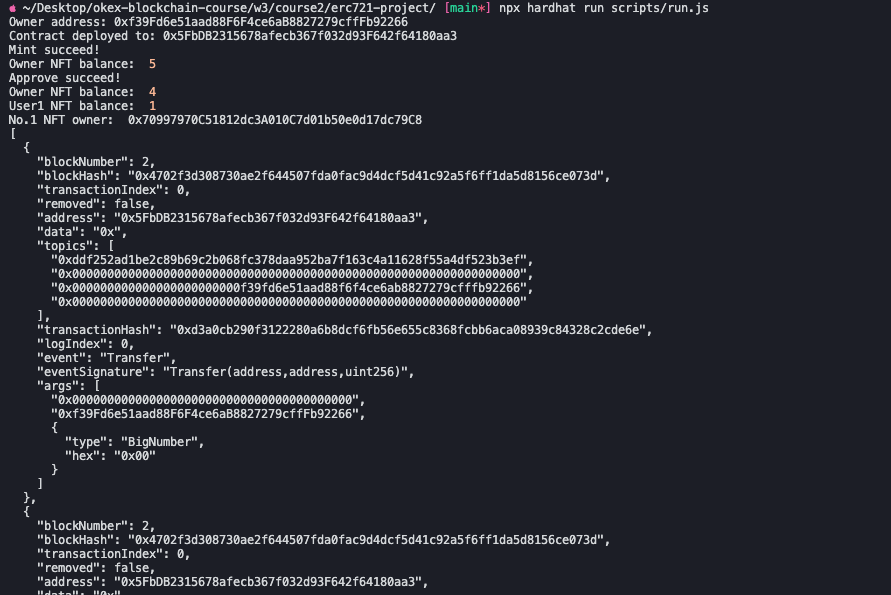
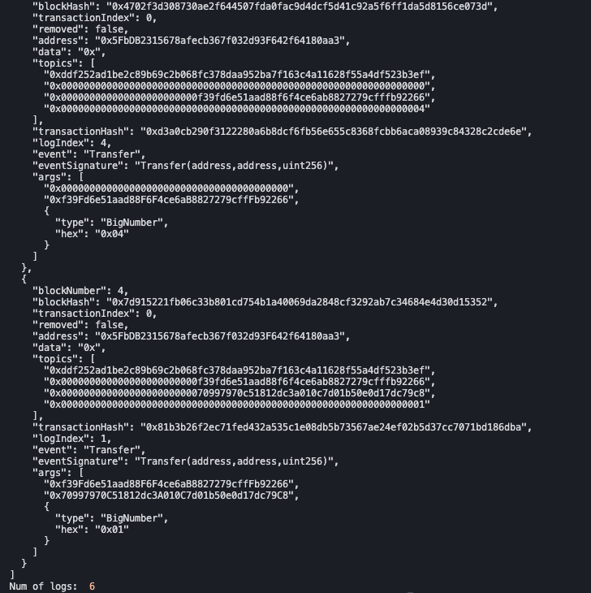
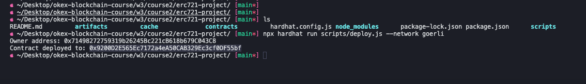
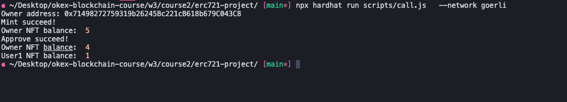
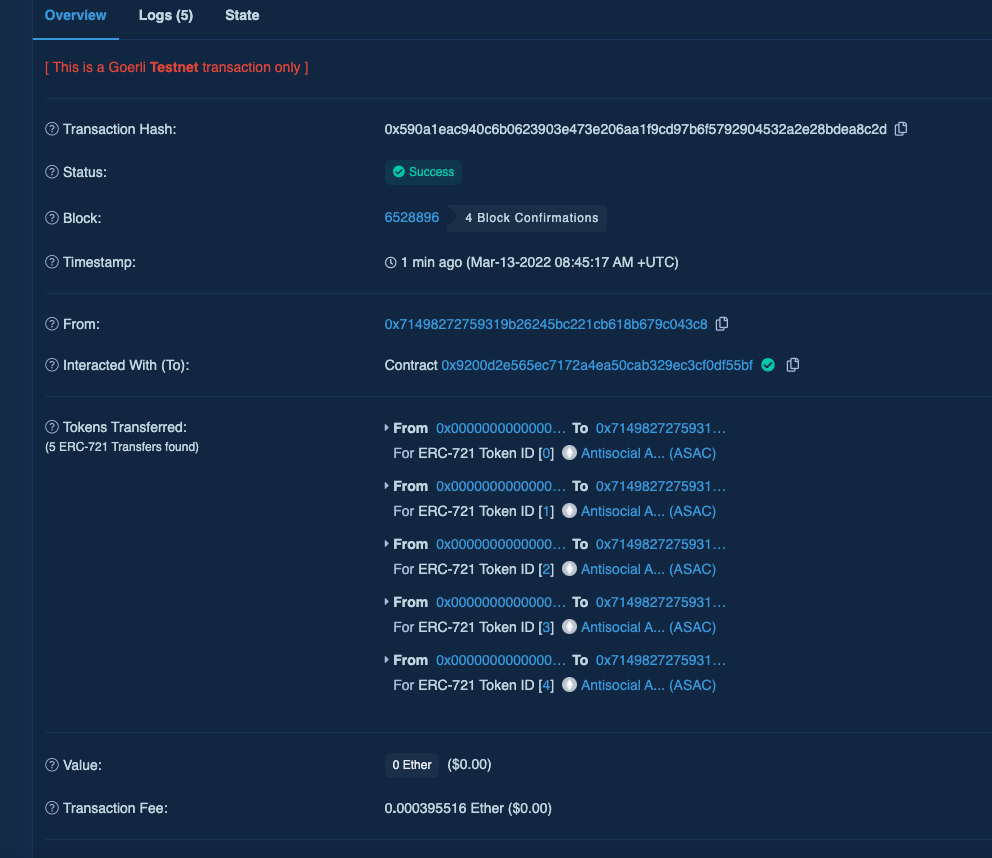
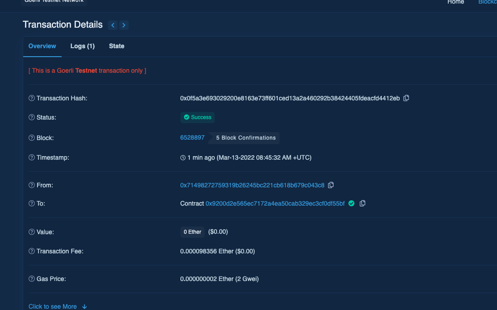
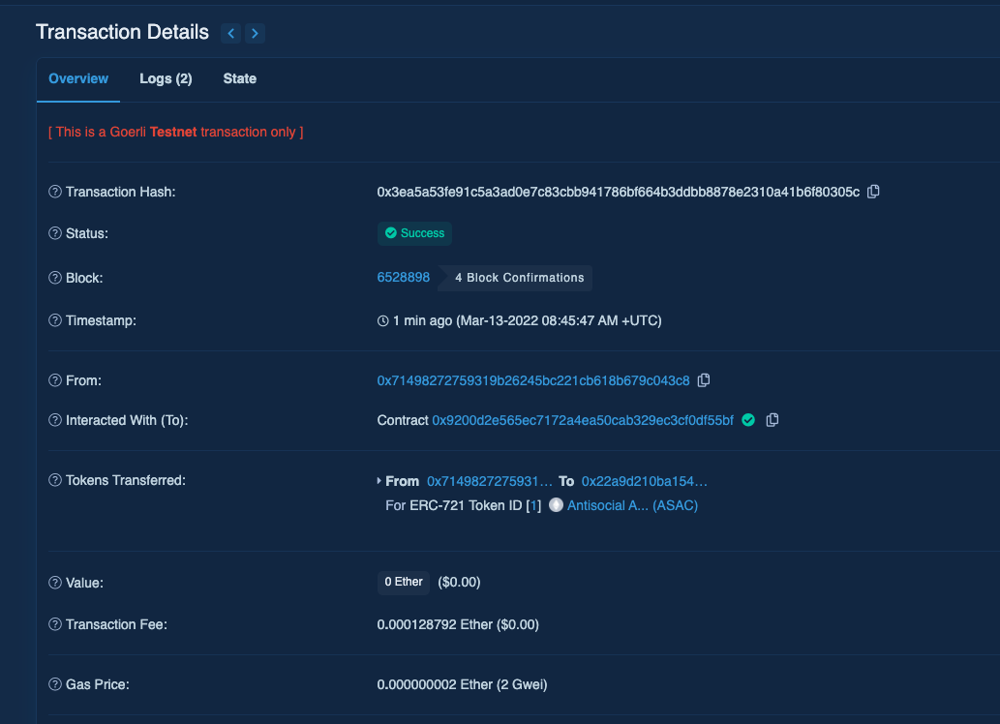
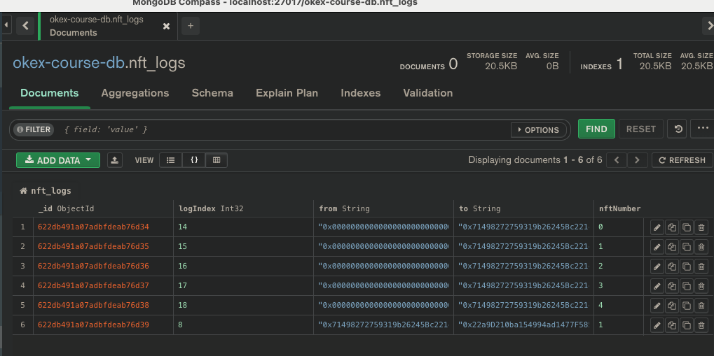

# Week3 - Course2

## 1.Remix调试截图


## 2.本地运行截图
```sh
cd erc721-project
npx hardhat run script/run.js
```




## 3.部署到goerli
```sh
npx hardhat run scripts/deploy.js --network goerli
```
Owner: 0x71498272759319b26245Bc221cB618b679C043C8

MyNFT: https://goerli.etherscan.io/address/0x9200D2E565Ec7172a4eA50CAB329Ec3cf0DF55bf

### 3.1 脚本调用合约Mint + Transfer
```sh
npx hardhat run scripts/call.js --network goerli
```


Mint

Tx: https://goerli.etherscan.io/tx/0x590a1eac940c6b0623903e473e206aa1f9cd97b6f5792904532a2e28bdea8c2d

Approve

Tx: https://goerli.etherscan.io/tx/0x0f5a3e693029200e8163e73ff601ced13a2a460292b38424405fdeacfd4412eb

Transfer

Tx: https://goerli.etherscan.io/tx/0x3ea5a53fe91c5a3ad0e7c83cbb941786bf664b3ddbb8878e2310a41b6f80305c

## 4.查询Event Log并保存到MongoDB
```sh
npx hardhat run scripts/get-log.js --network goerli
```


