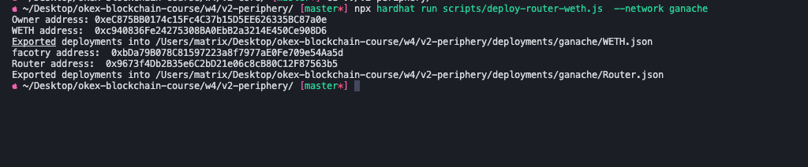

# Week4 - Course1 and 2

## 1.本地ganache运行截图

### 1.1部署UniswapV2Factory
```sh
cd ../v2-core
yarn
npx hardhat run scripts/deploy-factory.js --network ganache
```


### 1.2部署UniswapV2Router和WETH
```sh
cd ../v2-periphery
yarn
npx hardhat run scripts/deploy-router-weth.js --network ganache 
```


### 1.3部署SushiToken和MasterChef
```sh
cd my-token-market-project/
npx hardhat run scripts/deploy-sushi-masterchef.js --network ganache 
```


### 1.4部署Token和Market
```sh
npx hardhat run scripts/deploy-token-market.js --network ganache 
```


### 1.5运行
```sh
npx hardhat run scripts/run.js --network ganache 
```


由于测试币不足。。而且本地调试也花了好长的时间，所以只在Ganache做了。。。。。。。。