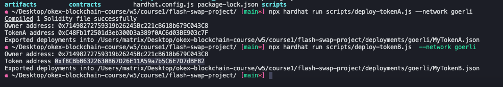
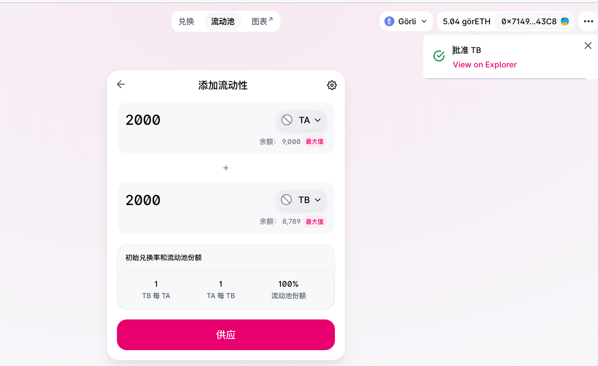
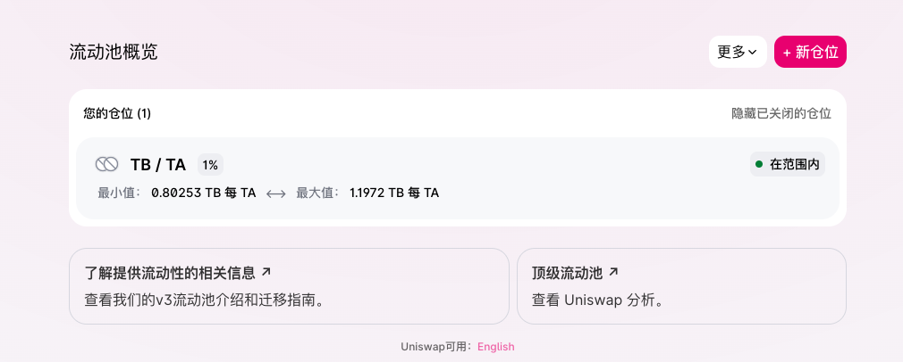

# Week5 - Course1

## 1.部署Token到goerli
```sh
cd flash-swap-project
npx hardhat run scripts/deploy-tokenA.js --network goerli
npx hardhat run scripts/deploy-tokenB.js --network goerli
```


## 2.UniswapV2和V3添加流动性





## 3.UniswapV2和V3闪电兑换
```sh
cd flash-swap-project
npx hardhat run scripts/call-flash-swap.js --network goerli
```


